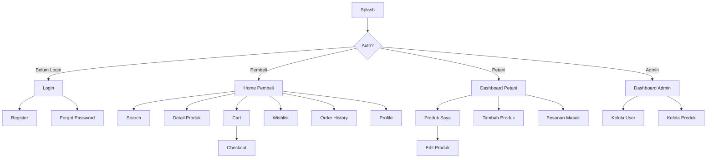

# Implementation Plan: Lapak Tani - Marketplace Hasil Pertanian

Aplikasi marketplace Flutter + Firebase yang menghubungkan petani dengan pembeli. Project sudah terkonfigurasi Firebase (`tapak-tani`) dengan Authentication, Firestore, dan Storage. UI dibuat sederhana tapi semua fitur berfungsi normal. Gambar produk menggunakan URL link.

---

## User Review Required

> [!IMPORTANT]
> **Keputusan Desain Utama:**
> - **Authentication**: Menggunakan Firebase Auth Email/Password (bukan Google Sign-In) sesuai permintaan. Username disimpan di Firestore collection `users`.
> - **Gambar Produk**: Menggunakan URL string (bukan Firebase Storage upload). Field `imageUrl` berupa text input URL.
> - **State Management**: Menggunakan `Provider` sesuai SRS.
> - **Routing**: Menggunakan routing manual `Navigator` (tanpa `go_router`) agar lebih sederhana.
> - **Google Maps & FCM**: Ditunda/skip karena fokus ke fitur inti yang fungsional.
> - **Admin Panel**: Diimplementasi sebagai role di dalam app, bukan panel terpisah.

> [!WARNING]
> **Fitur yang Di-skip (Bisa Ditambah Nanti):**
> - Google Maps lokasi petani (butuh API key & konfigurasi tambahan)
> - Firebase Cloud Messaging / Push Notification
> - Firebase Analytics & Crashlytics
> - Onboarding screen
> - Statistik petani (chart)

## Open Questions

> [!IMPORTANT]
> 1. **Kategori produk** — Apakah kategori yang diusulkan sudah sesuai? (Sayuran, Buah-buahan, Beras & Padi, Rempah-rempah, Umbi-umbian, Kacang-kacangan)
> 2. **Payment method** — Di SRS ada `paymentMethod` pada order. Karena ini prototype, saya akan buat sebagai pilihan string saja (COD, Transfer Bank) tanpa integrasi payment gateway. Apakah OK?
> 3. **Seeder** — Saya akan buat Dart script `seeder.dart` yang bisa dijalankan untuk mengisi data dummy ke Firestore. Data mencakup 3 user (1 admin, 1 petani, 1 pembeli), 6 kategori, 10+ produk, beberapa order & review.

---

## Arsitektur & Folder Structure

```
lib/
├── main.dart
├── firebase_options.dart
├── config/
│   └── app_theme.dart                    # Material 3 theme
├── models/
│   ├── user_model.dart                   # Model user
│   ├── product_model.dart                # Model produk  
│   ├── category_model.dart               # Model kategori
│   ├── cart_item_model.dart              # Model item keranjang
│   ├── order_model.dart                  # Model pesanan
│   ├── order_item_model.dart             # Model item pesanan
│   └── review_model.dart                 # Model review/rating
├── services/
│   ├── auth_service.dart                 # Firebase Auth service
│   ├── user_service.dart                 # Firestore CRUD users
│   ├── product_service.dart              # Firestore CRUD products
│   ├── category_service.dart             # Firestore CRUD categories
│   ├── cart_service.dart                 # Firestore CRUD cart
│   ├── order_service.dart                # Firestore CRUD orders
│   └── review_service.dart              # Firestore CRUD reviews
├── providers/
│   ├── auth_provider.dart                # Auth state provider
│   ├── product_provider.dart             # Product state provider
│   ├── cart_provider.dart                # Cart state provider
│   ├── order_provider.dart               # Order state provider
│   └── wishlist_provider.dart            # Wishlist state provider
├── screens/
│   ├── auth/
│   │   ├── login_screen.dart
│   │   ├── register_screen.dart
│   │   └── forgot_password_screen.dart
│   ├── buyer/
│   │   ├── home_screen.dart              # Dashboard pembeli + produk
│   │   ├── search_screen.dart            # Cari & filter produk
│   │   ├── product_detail_screen.dart    # Detail produk + review
│   │   ├── cart_screen.dart              # Keranjang belanja
│   │   ├── checkout_screen.dart          # Proses checkout
│   │   ├── wishlist_screen.dart          # Daftar wishlist
│   │   ├── order_history_screen.dart     # Riwayat pesanan
│   │   └── profile_screen.dart           # Profil pembeli
│   ├── seller/
│   │   ├── seller_dashboard_screen.dart  # Dashboard petani
│   │   ├── my_products_screen.dart       # Produk saya
│   │   ├── add_product_screen.dart       # Tambah produk
│   │   ├── edit_product_screen.dart      # Edit produk
│   │   └── seller_orders_screen.dart     # Pesanan masuk
│   ├── admin/
│   │   ├── admin_dashboard_screen.dart   # Dashboard admin
│   │   ├── manage_users_screen.dart      # Kelola pengguna
│   │   └── manage_products_screen.dart   # Kelola produk
│   └── splash_screen.dart
├── widgets/
│   ├── product_card.dart                 # Card produk reusable
│   ├── category_chip.dart                # Chip kategori
│   ├── order_status_badge.dart           # Badge status pesanan
│   ├── review_card.dart                  # Card review
│   ├── custom_text_field.dart            # TextField reusable
│   └── loading_widget.dart               # Loading indicator
└── seeder/
    └── firestore_seeder.dart             # Script seeder data dummy
```

---

## Firestore Schema (Lengkap)

### Collection: `users`
```
users/{uid}
├── uid: string                    # Firebase Auth UID
├── name: string                   # Nama lengkap
├── email: string                  # Email
├── phone: string                  # No. telepon
├── role: string                   # "pembeli" | "petani" | "admin"
├── photoUrl: string               # URL foto profil (opsional)
├── address: string                # Alamat lengkap
├── createdAt: timestamp           # Waktu registrasi
└── updatedAt: timestamp           # Waktu update terakhir
```

### Collection: `categories`
```
categories/{categoryId}
├── id: string                     # Auto-generated ID
├── name: string                   # Nama kategori
├── icon: string                   # Nama icon Material
└── createdAt: timestamp
```

### Collection: `products`
```
products/{productId}
├── id: string                     # Auto-generated ID
├── sellerId: string               # UID penjual (petani)
├── sellerName: string             # Nama penjual (denormalized)
├── categoryId: string             # ID kategori
├── categoryName: string           # Nama kategori (denormalized)
├── name: string                   # Nama produk
├── description: string            # Deskripsi produk
├── price: double                  # Harga per unit (Rp)
├── unit: string                   # Satuan (kg, ikat, buah, dll)
├── stock: int                     # Stok tersedia
├── imageUrl: string               # URL gambar produk
├── rating: double                 # Rata-rata rating (0-5)
├── reviewCount: int               # Jumlah review
├── isActive: bool                 # Status aktif/nonaktif
├── createdAt: timestamp
└── updatedAt: timestamp
```

### Collection: `carts`
```
carts/{uid}/items/{itemId}
├── productId: string              # ID produk
├── productName: string            # Nama produk (denormalized)
├── productImageUrl: string        # URL gambar (denormalized)
├── productPrice: double           # Harga saat ditambahkan
├── sellerId: string               # ID penjual
├── sellerName: string             # Nama penjual
├── quantity: int                  # Jumlah
└── addedAt: timestamp
```

### Collection: `wishlists`
```
wishlists/{uid}/items/{productId}
├── productId: string
├── productName: string
├── productImageUrl: string
├── productPrice: double
├── sellerName: string
└── addedAt: timestamp
```

### Collection: `orders`
```
orders/{orderId}
├── id: string                     # Auto-generated ID
├── buyerId: string                # UID pembeli
├── buyerName: string              # Nama pembeli
├── buyerAddress: string           # Alamat pengiriman
├── buyerPhone: string             # No. telepon pembeli
├── sellerId: string               # UID penjual
├── sellerName: string             # Nama penjual
├── items: array                   # Array of order items
│   ├── productId: string
│   ├── productName: string
│   ├── productImageUrl: string
│   ├── price: double
│   ├── quantity: int
│   └── subtotal: double
├── totalAmount: double            # Total harga
├── status: string                 # "pending" | "dikonfirmasi" | "dikirim" | "selesai" | "dibatalkan"
├── paymentMethod: string          # "COD" | "Transfer Bank"
├── notes: string                  # Catatan pembeli (opsional)
├── createdAt: timestamp
└── updatedAt: timestamp
```

### Collection: `reviews`
```
reviews/{reviewId}
├── id: string                     # Auto-generated ID
├── productId: string              # ID produk yang direview
├── userId: string                 # UID reviewer
├── userName: string               # Nama reviewer (denormalized)
├── orderId: string                # ID order terkait
├── rating: int                    # Rating 1-5
├── comment: string                # Komentar review
└── createdAt: timestamp
```

---

## Seeder Data (Lengkap)

Seeder akan berupa screen khusus `AdminSeederScreen` yang bisa dipanggil dari admin dashboard untuk mengisi data dummy. Berikut data yang akan di-seed:

### Users (3 akun — dibuat manual via Firebase Auth, lalu data profil di-seed ke Firestore)

| Email | Password | Nama | Role |
|-------|----------|------|------|
| admin@lapaktani.com | admin123 | Admin Lapak Tani | admin |
| petani@lapaktani.com | petani123 | Pak Tono | petani |
| pembeli@lapaktani.com | pembeli123 | Budi Santoso | pembeli |

> Seeder akan register ketiga akun ini via Firebase Auth lalu create document di Firestore.

### Categories (6 kategori)

| Nama | Icon |
|------|------|
| Sayuran | eco |
| Buah-buahan | apple |
| Beras & Padi | grain |
| Rempah-rempah | spa |
| Umbi-umbian | grass |
| Kacang-kacangan | scatter_plot |

### Products (12 produk — semua milik Pak Tono)

| Nama | Kategori | Harga | Stok | Satuan |
|------|----------|-------|------|--------|
| Bayam Segar | Sayuran | 5.000 | 50 | ikat |
| Kangkung Organik | Sayuran | 4.000 | 80 | ikat |
| Tomat Merah | Sayuran | 12.000 | 30 | kg |
| Mangga Harumanis | Buah-buahan | 25.000 | 20 | kg |
| Pisang Cavendish | Buah-buahan | 18.000 | 40 | sisir |
| Jeruk Manis | Buah-buahan | 20.000 | 25 | kg |
| Beras Pandan Wangi | Beras & Padi | 65.000 | 100 | 5kg |
| Beras Merah | Beras & Padi | 28.000 | 60 | kg |
| Jahe Merah | Rempah-rempah | 35.000 | 15 | kg |
| Kunyit Segar | Rempah-rempah | 15.000 | 40 | kg |
| Singkong | Umbi-umbian | 8.000 | 50 | kg |
| Kacang Tanah | Kacang-kacangan | 30.000 | 35 | kg |

> Gambar produk menggunakan URL dari Unsplash/Pixabay (free stock photo).

### Sample Orders (2 pesanan)

| Pembeli | Produk | Status | Payment |
|---------|--------|--------|---------|
| Budi | Bayam 2 ikat + Tomat 1kg | selesai | COD |
| Budi | Mangga 2kg | pending | Transfer Bank |

### Sample Reviews (2 review)

| Produk | User | Rating | Comment |
|--------|------|--------|---------|
| Bayam Segar | Budi | 5 | "Bayamnya segar sekali, pengiriman cepat!" |
| Tomat Merah | Budi | 4 | "Tomat bagus, cuma ada beberapa yang agak lembek" |

---

## Proposed Changes (Per Sprint)

### Sprint 1: Foundation & Authentication

#### Config & Theme
##### [NEW] [app_theme.dart](file:///c:/Users/User/Desktop/KULIAH/SEMESTER%206/PEMROGRAMAN_MOBILE/TB/lapak_tani/lib/config/app_theme.dart)
- Material 3 theme dengan warna hijau (nuansa pertanian)
- Text theme, color scheme, component themes

##### [MODIFY] [pubspec.yaml](file:///c:/Users/User/Desktop/KULIAH/SEMESTER%206/PEMROGRAMAN_MOBILE/TB/lapak_tani/pubspec.yaml)
- Tambah dependencies: `provider`, `intl` (format currency)

##### [MODIFY] [main.dart](file:///c:/Users/User/Desktop/KULIAH/SEMESTER%206/PEMROGRAMAN_MOBILE/TB/lapak_tani/lib/main.dart)
- Initialize Firebase
- Setup MultiProvider (AuthProvider, CartProvider, WishlistProvider, dll)
- Routing: SplashScreen → Login/Home berdasarkan auth state

#### Models
##### [NEW] [user_model.dart](file:///c:/Users/User/Desktop/KULIAH/SEMESTER%206/PEMROGRAMAN_MOBILE/TB/lapak_tani/lib/models/user_model.dart)
##### [NEW] [product_model.dart](file:///c:/Users/User/Desktop/KULIAH/SEMESTER%206/PEMROGRAMAN_MOBILE/TB/lapak_tani/lib/models/product_model.dart)
##### [NEW] [category_model.dart](file:///c:/Users/User/Desktop/KULIAH/SEMESTER%206/PEMROGRAMAN_MOBILE/TB/lapak_tani/lib/models/category_model.dart)
##### [NEW] [cart_item_model.dart](file:///c:/Users/User/Desktop/KULIAH/SEMESTER%206/PEMROGRAMAN_MOBILE/TB/lapak_tani/lib/models/cart_item_model.dart)
##### [NEW] [order_model.dart](file:///c:/Users/User/Desktop/KULIAH/SEMESTER%206/PEMROGRAMAN_MOBILE/TB/lapak_tani/lib/models/order_model.dart)
##### [NEW] [order_item_model.dart](file:///c:/Users/User/Desktop/KULIAH/SEMESTER%206/PEMROGRAMAN_MOBILE/TB/lapak_tani/lib/models/order_item_model.dart)
##### [NEW] [review_model.dart](file:///c:/Users/User/Desktop/KULIAH/SEMESTER%206/PEMROGRAMAN_MOBILE/TB/lapak_tani/lib/models/review_model.dart)

- Semua model punya `fromMap()`, `toMap()`, dan `fromFirestore()`

#### Services
##### [NEW] [auth_service.dart](file:///c:/Users/User/Desktop/KULIAH/SEMESTER%206/PEMROGRAMAN_MOBILE/TB/lapak_tani/lib/services/auth_service.dart)
- `register(email, password, name, phone, role)`
- `login(email, password)`
- `logout()`
- `resetPassword(email)`
- `getCurrentUser()`

##### [NEW] [user_service.dart](file:///c:/Users/User/Desktop/KULIAH/SEMESTER%206/PEMROGRAMAN_MOBILE/TB/lapak_tani/lib/services/user_service.dart)
- CRUD operasi user di Firestore
- `getUserById()`, `updateProfile()`, `getAllUsers()` (admin)

#### Providers
##### [NEW] [auth_provider.dart](file:///c:/Users/User/Desktop/KULIAH/SEMESTER%206/PEMROGRAMAN_MOBILE/TB/lapak_tani/lib/providers/auth_provider.dart)
- State: currentUser, isLoading, error
- Methods: login, register, logout, checkAuth

#### Screens - Auth
##### [NEW] [splash_screen.dart](file:///c:/Users/User/Desktop/KULIAH/SEMESTER%206/PEMROGRAMAN_MOBILE/TB/lapak_tani/lib/screens/splash_screen.dart)
- Logo + loading → cek auth state → navigate ke login/home
##### [NEW] [login_screen.dart](file:///c:/Users/User/Desktop/KULIAH/SEMESTER%206/PEMROGRAMAN_MOBILE/TB/lapak_tani/lib/screens/auth/login_screen.dart)
- Form email + password, tombol login, link register & lupa password
##### [NEW] [register_screen.dart](file:///c:/Users/User/Desktop/KULIAH/SEMESTER%206/PEMROGRAMAN_MOBILE/TB/lapak_tani/lib/screens/auth/register_screen.dart)
- Form nama, email, phone, password, pilih role (pembeli/petani)
##### [NEW] [forgot_password_screen.dart](file:///c:/Users/User/Desktop/KULIAH/SEMESTER%206/PEMROGRAMAN_MOBILE/TB/lapak_tani/lib/screens/auth/forgot_password_screen.dart)
- Form email, kirim reset password

#### Widgets
##### [NEW] [custom_text_field.dart](file:///c:/Users/User/Desktop/KULIAH/SEMESTER%206/PEMROGRAMAN_MOBILE/TB/lapak_tani/lib/widgets/custom_text_field.dart)
##### [NEW] [loading_widget.dart](file:///c:/Users/User/Desktop/KULIAH/SEMESTER%206/PEMROGRAMAN_MOBILE/TB/lapak_tani/lib/widgets/loading_widget.dart)

---

### Sprint 2: Home & Produk (Pembeli)

#### Services
##### [NEW] [product_service.dart](file:///c:/Users/User/Desktop/KULIAH/SEMESTER%206/PEMROGRAMAN_MOBILE/TB/lapak_tani/lib/services/product_service.dart)
- `getAllProducts()`, `getProductById()`, `getProductsByCategory()`, `searchProducts()`
##### [NEW] [category_service.dart](file:///c:/Users/User/Desktop/KULIAH/SEMESTER%206/PEMROGRAMAN_MOBILE/TB/lapak_tani/lib/services/category_service.dart)
- `getAllCategories()`

#### Providers
##### [NEW] [product_provider.dart](file:///c:/Users/User/Desktop/KULIAH/SEMESTER%206/PEMROGRAMAN_MOBILE/TB/lapak_tani/lib/providers/product_provider.dart)

#### Screens
##### [NEW] [home_screen.dart](file:///c:/Users/User/Desktop/KULIAH/SEMESTER%206/PEMROGRAMAN_MOBILE/TB/lapak_tani/lib/screens/buyer/home_screen.dart)
- Kategori horizontal scroll, produk grid, search bar
##### [NEW] [search_screen.dart](file:///c:/Users/User/Desktop/KULIAH/SEMESTER%206/PEMROGRAMAN_MOBILE/TB/lapak_tani/lib/screens/buyer/search_screen.dart)
- Pencarian real-time + filter kategori
##### [NEW] [product_detail_screen.dart](file:///c:/Users/User/Desktop/KULIAH/SEMESTER%206/PEMROGRAMAN_MOBILE/TB/lapak_tani/lib/screens/buyer/product_detail_screen.dart)
- Gambar, detail, harga, stok, tombol wishlist & add to cart, list review

#### Widgets
##### [NEW] [product_card.dart](file:///c:/Users/User/Desktop/KULIAH/SEMESTER%206/PEMROGRAMAN_MOBILE/TB/lapak_tani/lib/widgets/product_card.dart)
##### [NEW] [category_chip.dart](file:///c:/Users/User/Desktop/KULIAH/SEMESTER%206/PEMROGRAMAN_MOBILE/TB/lapak_tani/lib/widgets/category_chip.dart)

---

### Sprint 3: Cart, Checkout & Wishlist

#### Services
##### [NEW] [cart_service.dart](file:///c:/Users/User/Desktop/KULIAH/SEMESTER%206/PEMROGRAMAN_MOBILE/TB/lapak_tani/lib/services/cart_service.dart)
- `getCartItems()`, `addToCart()`, `updateQuantity()`, `removeFromCart()`, `clearCart()`

#### Providers
##### [NEW] [cart_provider.dart](file:///c:/Users/User/Desktop/KULIAH/SEMESTER%206/PEMROGRAMAN_MOBILE/TB/lapak_tani/lib/providers/cart_provider.dart)
##### [NEW] [wishlist_provider.dart](file:///c:/Users/User/Desktop/KULIAH/SEMESTER%206/PEMROGRAMAN_MOBILE/TB/lapak_tani/lib/providers/wishlist_provider.dart)

#### Screens
##### [NEW] [cart_screen.dart](file:///c:/Users/User/Desktop/KULIAH/SEMESTER%206/PEMROGRAMAN_MOBILE/TB/lapak_tani/lib/screens/buyer/cart_screen.dart)
- List item, ubah quantity, hapus item, total, tombol checkout
##### [NEW] [checkout_screen.dart](file:///c:/Users/User/Desktop/KULIAH/SEMESTER%206/PEMROGRAMAN_MOBILE/TB/lapak_tani/lib/screens/buyer/checkout_screen.dart)
- Alamat pengiriman, metode bayar (COD/Transfer), ringkasan, tombol pesan
##### [NEW] [wishlist_screen.dart](file:///c:/Users/User/Desktop/KULIAH/SEMESTER%206/PEMROGRAMAN_MOBILE/TB/lapak_tani/lib/screens/buyer/wishlist_screen.dart)
- Grid produk yang di-wishlist, toggle wishlist

---

### Sprint 4: Manajemen Produk (Petani)

#### Services (tambahan method di product_service.dart)
- `addProduct()`, `updateProduct()`, `deleteProduct()`, `getSellerProducts()`, `updateStock()`

#### Screens
##### [NEW] [seller_dashboard_screen.dart](file:///c:/Users/User/Desktop/KULIAH/SEMESTER%206/PEMROGRAMAN_MOBILE/TB/lapak_tani/lib/screens/seller/seller_dashboard_screen.dart)
- Ringkasan: jumlah produk, pesanan masuk, total pendapatan
##### [NEW] [my_products_screen.dart](file:///c:/Users/User/Desktop/KULIAH/SEMESTER%206/PEMROGRAMAN_MOBILE/TB/lapak_tani/lib/screens/seller/my_products_screen.dart)
- List produk milik petani, kelola stok, edit, hapus
##### [NEW] [add_product_screen.dart](file:///c:/Users/User/Desktop/KULIAH/SEMESTER%206/PEMROGRAMAN_MOBILE/TB/lapak_tani/lib/screens/seller/add_product_screen.dart)
- Form: nama, deskripsi, harga, stok, satuan, kategori, URL gambar
##### [NEW] [edit_product_screen.dart](file:///c:/Users/User/Desktop/KULIAH/SEMESTER%206/PEMROGRAMAN_MOBILE/TB/lapak_tani/lib/screens/seller/edit_product_screen.dart)
- Pre-filled form edit produk

---

### Sprint 5: Pesanan, Review & Admin

#### Services
##### [NEW] [order_service.dart](file:///c:/Users/User/Desktop/KULIAH/SEMESTER%206/PEMROGRAMAN_MOBILE/TB/lapak_tani/lib/services/order_service.dart)
- `createOrder()`, `getOrdersByBuyer()`, `getOrdersBySeller()`, `updateOrderStatus()`
##### [NEW] [review_service.dart](file:///c:/Users/User/Desktop/KULIAH/SEMESTER%206/PEMROGRAMAN_MOBILE/TB/lapak_tani/lib/services/review_service.dart)
- `addReview()`, `getReviewsByProduct()`

#### Providers
##### [NEW] [order_provider.dart](file:///c:/Users/User/Desktop/KULIAH/SEMESTER%206/PEMROGRAMAN_MOBILE/TB/lapak_tani/lib/providers/order_provider.dart)

#### Screens - Buyer
##### [NEW] [order_history_screen.dart](file:///c:/Users/User/Desktop/KULIAH/SEMESTER%206/PEMROGRAMAN_MOBILE/TB/lapak_tani/lib/screens/buyer/order_history_screen.dart)
- List pesanan + status badge, tombol review untuk order "selesai"
##### [NEW] [profile_screen.dart](file:///c:/Users/User/Desktop/KULIAH/SEMESTER%206/PEMROGRAMAN_MOBILE/TB/lapak_tani/lib/screens/buyer/profile_screen.dart)
- Info profil, edit profil, logout

#### Screens - Seller
##### [NEW] [seller_orders_screen.dart](file:///c:/Users/User/Desktop/KULIAH/SEMESTER%206/PEMROGRAMAN_MOBILE/TB/lapak_tani/lib/screens/seller/seller_orders_screen.dart)
- List pesanan masuk, update status (konfirmasi → kirim → selesai)

#### Screens - Admin
##### [NEW] [admin_dashboard_screen.dart](file:///c:/Users/User/Desktop/KULIAH/SEMESTER%206/PEMROGRAMAN_MOBILE/TB/lapak_tani/lib/screens/admin/admin_dashboard_screen.dart)
- Total user, total produk, total order
##### [NEW] [manage_users_screen.dart](file:///c:/Users/User/Desktop/KULIAH/SEMESTER%206/PEMROGRAMAN_MOBILE/TB/lapak_tani/lib/screens/admin/manage_users_screen.dart)
- List semua user, lihat detail
##### [NEW] [manage_products_screen.dart](file:///c:/Users/User/Desktop/KULIAH/SEMESTER%206/PEMROGRAMAN_MOBILE/TB/lapak_tani/lib/screens/admin/manage_products_screen.dart)
- List semua produk, hapus produk bermasalah

#### Widgets
##### [NEW] [order_status_badge.dart](file:///c:/Users/User/Desktop/KULIAH/SEMESTER%206/PEMROGRAMAN_MOBILE/TB/lapak_tani/lib/widgets/order_status_badge.dart)
##### [NEW] [review_card.dart](file:///c:/Users/User/Desktop/KULIAH/SEMESTER%206/PEMROGRAMAN_MOBILE/TB/lapak_tani/lib/widgets/review_card.dart)

---

### Sprint 6: Seeder

##### [NEW] [firestore_seeder.dart](file:///c:/Users/User/Desktop/KULIAH/SEMESTER%206/PEMROGRAMAN_MOBILE/TB/lapak_tani/lib/seeder/firestore_seeder.dart)
- Class `FirestoreSeeder` dengan method:
  - `seedAll()` — jalankan semua seeder
  - `seedUsers()` — register 3 akun + profil di Firestore
  - `seedCategories()` — 6 kategori
  - `seedProducts()` — 12 produk dengan URL gambar
  - `seedOrders()` — 2 sample order
  - `seedReviews()` — 2 sample review
- Dipanggil dari admin dashboard via tombol "Seed Data"

---

## Alur Navigasi



---

## Total File: ~40 file baru + 2 modifikasi

## Verification Plan

### Automated Tests
- `flutter analyze` — cek static analysis
- `flutter build apk --debug` — pastikan build berhasil

### Manual Verification
1. Jalankan `flutter run` di emulator/device
2. Test register akun baru (pembeli & petani)
3. Login dengan setiap role → pastikan masuk dashboard yang benar
4. Jalankan seeder dari admin dashboard
5. Browse produk, search, filter kategori
6. Add to cart → checkout → cek order history
7. Petani: tambah produk, edit, update stok
8. Review produk setelah order selesai
9. Admin: lihat list user & produk, hapus produk
