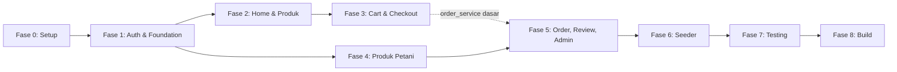

# Phase Pengerjaan Lengkap — Lapak Tani (Marketplace Hasil Pertanian)

Dokumen ini menjabarkan seluruh implementation plan menjadi **fase pengerjaan step-by-step** yang bisa langsung diikuti dari nol sampai aplikasi siap di-build. Total ada **9 fase** (Fase 0 s/d Fase 8), mengikuti struktur Sprint 1–6 di implementation plan, ditambah fase persiapan, testing, dan build/deployment.

> Urutan fase bersifat **sekuensial** — fase berikutnya bergantung pada model/service yang dibuat di fase sebelumnya. Jangan lompat fase kecuali sudah paham dependensinya.

---

## Ringkasan Fase

| Fase | Nama | Fokus | Estimasi |
|------|------|-------|----------|
| 0 | Persiapan & Setup | Environment, dependencies, Firebase | 0.5 hari |
| 1 | Foundation & Authentication | Model, theme, auth, splash | 1.5 hari |
| 2 | Home & Produk (Pembeli) | Browse, search, detail produk | 1.5 hari |
| 3 | Cart, Checkout & Wishlist | Keranjang, checkout, wishlist | 1.5 hari |
| 4 | Manajemen Produk (Petani) | CRUD produk milik petani | 1 hari |
| 5 | Pesanan, Review & Admin | Order flow, review, admin panel | 2 hari |
| 6 | Seeder | Data dummy untuk demo/testing | 0.5 hari |
| 7 | Testing & QA | Analisis, uji manual end-to-end | 1 hari |
| 8 | Build & Deployment | Build APK, dokumentasi akhir | 0.5 hari |

**Total estimasi: ~10 hari kerja** (asumsi 1 developer, disesuaikan lagi dengan kecepatan masing-masing).

---

## Fase 0 — Persiapan & Setup Project

**Tujuan:** Memastikan environment siap sebelum coding dimulai.

### Checklist
- [ ] Pastikan Flutter SDK & toolchain terinstal (`flutter doctor` bersih)
- [ ] Clone/buka project `lapak_tani`, pastikan Firebase project `tapak-tani` sudah terkonfigurasi (Authentication, Firestore, Storage aktif)
- [ ] Tambahkan dependency di `pubspec.yaml`: `provider`, `intl`
- [ ] Jalankan `flutter pub get`
- [ ] Setup Firestore Security Rules dasar (role-based: pembeli, petani, admin)
- [ ] Buat struktur folder sesuai arsitektur (`config/`, `models/`, `services/`, `providers/`, `screens/`, `widgets/`, `seeder/`)
- [ ] Konfirmasi 3 open question ke stakeholder/dosen (kategori produk, payment method sebagai string, seeder scope) sebelum lanjut ke Fase 1

### Definition of Done
Project bisa di-run (`flutter run`) menampilkan default screen tanpa error, Firebase terkoneksi.

---

## Fase 1 — Foundation & Authentication *(Sprint 1)*

**Tujuan:** Membangun fondasi aplikasi: tema, model data inti, autentikasi, dan navigasi awal.

### 1.1 Config & Theme
- [ ] `config/app_theme.dart` — Material 3 theme nuansa hijau (color scheme, text theme, component theme)
- [ ] `[MODIFY] pubspec.yaml` — tambah `provider`, `intl`
- [ ] `[MODIFY] main.dart` — init Firebase, setup `MultiProvider` (AuthProvider dulu, provider lain ditambah bertahap di fase berikutnya), routing awal Splash → Login/Home

### 1.2 Models (buat semua sekaligus, dipakai di fase-fase berikutnya)
- [ ] `user_model.dart`
- [ ] `product_model.dart`
- [ ] `category_model.dart`
- [ ] `cart_item_model.dart`
- [ ] `order_model.dart`
- [ ] `order_item_model.dart`
- [ ] `review_model.dart`

Setiap model wajib punya `fromMap()`, `toMap()`, `fromFirestore()`.

### 1.3 Services
- [ ] `auth_service.dart` — `register()`, `login()`, `logout()`, `resetPassword()`, `getCurrentUser()`
- [ ] `user_service.dart` — `getUserById()`, `updateProfile()`, `getAllUsers()`

### 1.4 Providers
- [ ] `auth_provider.dart` — state `currentUser`, `isLoading`, `error`; method `login`, `register`, `logout`, `checkAuth`

### 1.5 Screens & Widgets
- [ ] `splash_screen.dart` — cek auth state → arahkan ke login/home sesuai role
- [ ] `login_screen.dart`
- [ ] `register_screen.dart` — pilih role pembeli/petani
- [ ] `forgot_password_screen.dart`
- [ ] `custom_text_field.dart`
- [ ] `loading_widget.dart`

### Verifikasi Fase 1
1. Register akun baru sebagai pembeli → cek dokumen dibuat di `users` collection
2. Register akun baru sebagai petani
3. Login/logout berjalan normal, error handling muncul saat kredensial salah
4. Reset password mengirim email

### Definition of Done
Alur splash → login/register → (placeholder home) berjalan tanpa error, data user tersimpan benar di Firestore.

---

## Fase 2 — Home & Produk (Pembeli) *(Sprint 2)*

**Tujuan:** Pembeli bisa melihat, mencari, dan melihat detail produk.

### Checklist
- [ ] `product_service.dart` — `getAllProducts()`, `getProductById()`, `getProductsByCategory()`, `searchProducts()`
- [ ] `category_service.dart` — `getAllCategories()`
- [ ] `product_provider.dart` — daftarkan ke `MultiProvider` di `main.dart`
- [ ] `home_screen.dart` — kategori horizontal scroll, grid produk, search bar
- [ ] `search_screen.dart` — pencarian real-time + filter kategori
- [ ] `product_detail_screen.dart` — gambar, detail, harga, stok, tombol wishlist & add to cart, list review (list review sementara kosong dulu, diisi penuh di Fase 5)
- [ ] `product_card.dart`
- [ ] `category_chip.dart`

> Catatan: karena kategori belum ada data (seeder baru di Fase 6), sediakan minimal 1–2 kategori manual via Firebase Console untuk keperluan testing UI di fase ini.

### Verifikasi Fase 2
1. Home menampilkan kategori & produk (pakai data manual sementara)
2. Search & filter kategori berjalan
3. Klik produk → masuk ke detail dengan data benar

### Definition of Done
Pembeli bisa browse, cari, filter, dan melihat detail produk dari Firestore secara real-time.

---

## Fase 3 — Cart, Checkout & Wishlist *(Sprint 3)*

**Tujuan:** Pembeli bisa menyimpan produk ke keranjang/wishlist dan menyelesaikan checkout.

### Checklist
- [ ] `cart_service.dart` — `getCartItems()`, `addToCart()`, `updateQuantity()`, `removeFromCart()`, `clearCart()`
- [ ] `cart_provider.dart`
- [ ] `wishlist_provider.dart`
- [ ] `cart_screen.dart` — list item, ubah qty, hapus, total, tombol checkout
- [ ] `checkout_screen.dart` — alamat pengiriman, pilih metode bayar (COD/Transfer Bank sebagai string), ringkasan, tombol pesan → memanggil pembuatan order (service order dibuat di Fase 5, bisa stub sementara atau langsung buat `order_service.dart` lebih awal jika ingin checkout langsung fungsional)
- [ ] `wishlist_screen.dart` — grid produk wishlist, toggle wishlist

> **Keputusan urutan:** Checkout butuh `order_service.dart` (baru resmi di Fase 5). Dua opsi:
> - **Opsi A (disarankan):** kerjakan `order_service.dart` versi dasar (`createOrder()`) di fase ini juga, supaya checkout langsung end-to-end. Method order lain (`getOrdersByBuyer`, dst.) tetap dikerjakan di Fase 5.
> - **Opsi B:** checkout dulu simpan ke state lokal/placeholder, integrasi penuh menyusul di Fase 5.

### Verifikasi Fase 3
1. Add to cart dari home & detail produk
2. Ubah quantity, hapus item, cart total ter-update
3. Checkout: isi alamat, pilih metode bayar, submit → order tersimpan di Firestore
4. Toggle wishlist dari product card/detail, cek `wishlists/{uid}/items`

### Definition of Done
Alur cart → checkout → order tersimpan berjalan tanpa error; wishlist berfungsi penuh.

---

## Fase 4 — Manajemen Produk (Petani) *(Sprint 4)*

**Tujuan:** Petani bisa mengelola produk miliknya sendiri.

### Checklist
- [ ] Tambah method di `product_service.dart`: `addProduct()`, `updateProduct()`, `deleteProduct()`, `getSellerProducts()`, `updateStock()`
- [ ] `seller_dashboard_screen.dart` — ringkasan jumlah produk, pesanan masuk, total pendapatan (data pesanan bisa sementara placeholder sebelum Fase 5 selesai)
- [ ] `my_products_screen.dart` — list produk milik petani, kelola stok, tombol edit/hapus
- [ ] `add_product_screen.dart` — form nama, deskripsi, harga, stok, satuan, kategori (dropdown dari `category_service`), URL gambar
- [ ] `edit_product_screen.dart` — form pre-filled untuk update produk

### Verifikasi Fase 4
1. Login sebagai petani → dashboard muncul dengan data benar
2. Tambah produk baru → muncul di `my_products_screen` dan juga di home pembeli
3. Edit produk → perubahan tersimpan
4. Hapus produk → hilang dari list & home pembeli
5. Update stok → tervalidasi (tidak minus)

### Definition of Done
Petani punya kontrol penuh CRUD atas produknya sendiri, terisolasi dari produk petani lain (filter by `sellerId`).

---

## Fase 5 — Pesanan, Review & Admin *(Sprint 5)*

**Tujuan:** Melengkapi siklus order (dari pembeli ke petani), fitur review, dan panel admin.

### 5.1 Order & Review Services
- [ ] `order_service.dart` — lengkapi `createOrder()` (jika belum penuh dari Fase 3), tambah `getOrdersByBuyer()`, `getOrdersBySeller()`, `updateOrderStatus()`
- [ ] `review_service.dart` — `addReview()`, `getReviewsByProduct()`
- [ ] `order_provider.dart`

### 5.2 Screens - Buyer
- [ ] `order_history_screen.dart` — list pesanan + status badge, tombol review muncul untuk status "selesai"
- [ ] `profile_screen.dart` — info profil, edit profil, logout
- [ ] Update `product_detail_screen.dart` agar list review benar-benar menampilkan data dari `review_service`

### 5.3 Screens - Seller
- [ ] `seller_orders_screen.dart` — list pesanan masuk, update status (pending → dikonfirmasi → dikirim → selesai)
- [ ] Update `seller_dashboard_screen.dart` agar ringkasan pesanan & pendapatan menggunakan data order asli

### 5.4 Screens - Admin
- [ ] `admin_dashboard_screen.dart` — total user, total produk, total order
- [ ] `manage_users_screen.dart` — list semua user, lihat detail
- [ ] `manage_products_screen.dart` — list semua produk, hapus produk bermasalah

### 5.5 Widgets
- [ ] `order_status_badge.dart`
- [ ] `review_card.dart`

### Verifikasi Fase 5
1. Buyer: order baru muncul di history dengan status "pending"
2. Seller: order masuk di `seller_orders_screen`, update status berhasil, status ter-sync ke buyer
3. Setelah status "selesai", buyer bisa submit review; rating & `reviewCount` di produk ter-update
4. Admin: dashboard menampilkan angka benar; bisa lihat semua user & hapus produk

### Definition of Done
Siklus order lengkap (checkout → konfirmasi petani → kirim → selesai → review) berjalan penuh; admin punya visibilitas dan kontrol dasar.

---

## Fase 6 — Seeder *(Sprint 6)*

**Tujuan:** Menyediakan data dummy realistis agar app siap didemokan/diuji tanpa input manual.

### Checklist
- [ ] `seeder/firestore_seeder.dart` — class `FirestoreSeeder` dengan method:
  - [ ] `seedAll()`
  - [ ] `seedUsers()` — register 3 akun (admin, petani "Pak Tono", pembeli "Budi Santoso") + profil Firestore
  - [ ] `seedCategories()` — 6 kategori (Sayuran, Buah-buahan, Beras & Padi, Rempah-rempah, Umbi-umbian, Kacang-kacangan)
  - [ ] `seedProducts()` — 12 produk milik Pak Tono dengan URL gambar stok foto
  - [ ] `seedOrders()` — 2 order contoh (1 selesai/COD, 1 pending/Transfer Bank)
  - [ ] `seedReviews()` — 2 review contoh
- [ ] Tambahkan tombol "Seed Data" di `admin_dashboard_screen.dart` yang memanggil `seedAll()`
- [ ] Tambahkan guard sederhana agar seeder tidak dobel-jalan (cek apakah data sudah ada sebelum insert, atau tampilkan konfirmasi dialog)

### Verifikasi Fase 6
1. Klik "Seed Data" dari admin dashboard → 3 user, 6 kategori, 12 produk, 2 order, 2 review muncul di Firestore
2. Login dengan masing-masing akun seeded, pastikan role & data cocok
3. Jalankan ulang seeder → tidak menghasilkan duplikat data yang merusak (atau minimal tidak error)

### Definition of Done
Satu klik seeder menghasilkan dataset lengkap yang siap dipakai untuk demo end-to-end.

---

## Fase 7 — Testing & QA

**Tujuan:** Memastikan seluruh fitur inti berjalan stabil sebelum build final.

### Automated
- [ ] `flutter analyze` — pastikan tidak ada error/warning signifikan
- [ ] `flutter build apk --debug` — pastikan build sukses

### Manual (End-to-End, urutan disarankan)
1. [ ] `flutter run` di emulator/device
2. [ ] Register akun baru (pembeli & petani)
3. [ ] Login dengan setiap role → pastikan masuk dashboard yang benar
4. [ ] Jalankan seeder dari admin dashboard
5. [ ] Browse produk, search, filter kategori
6. [ ] Add to cart → checkout → cek order history
7. [ ] Petani: tambah produk, edit, update stok
8. [ ] Review produk setelah order berstatus "selesai"
9. [ ] Admin: lihat list user & produk, hapus produk
10. [ ] Uji edge case: stok habis, cart kosong saat checkout, email/password invalid saat login, koneksi Firestore terputus (opsional)

### Definition of Done
Semua item checklist manual di atas lulus tanpa crash; `flutter analyze` bersih.

---

## Fase 8 — Build & Deployment

**Tujuan:** Menyiapkan build akhir dan dokumentasi serah-terima.

### Checklist
- [ ] `flutter build apk --release` (atau `--debug` jika untuk keperluan tugas kuliah/demo)
- [ ] Cek ukuran & performa APK di device fisik
- [ ] Siapkan dokumentasi singkat: cara install, akun demo (dari seeder), fitur yang di-skip (Maps, FCM, Analytics, Onboarding, Statistik) sebagai catatan pengembangan lanjutan
- [ ] (Opsional) Update Firestore Security Rules dari mode test ke mode lebih ketat sebelum dianggap "production-ready"

### Definition of Done
APK siap diinstal/didemokan, dokumentasi serah-terima lengkap.

---

## Catatan Dependensi Antar-Fase

- Fase 2 & Fase 4 sama-sama bergantung pada Fase 1 (model & auth), tapi **tidak saling bergantung** satu sama lain — bisa dikerjakan paralel jika ada 2 developer.
- Fase 3 butuh sebagian kecil `order_service.dart` (lihat catatan "Opsi A/B" di Fase 3) sebelum Fase 5 menuntaskan sisanya.
- Fase 6 (Seeder) sebaiknya dikerjakan **setelah** semua model & service selesai (Fase 1–5), karena seeder memakai semua service tersebut.

---

## Total Deliverable
~40 file baru + 2 file modifikasi (`pubspec.yaml`, `main.dart`), sesuai rincian di implementation plan.
